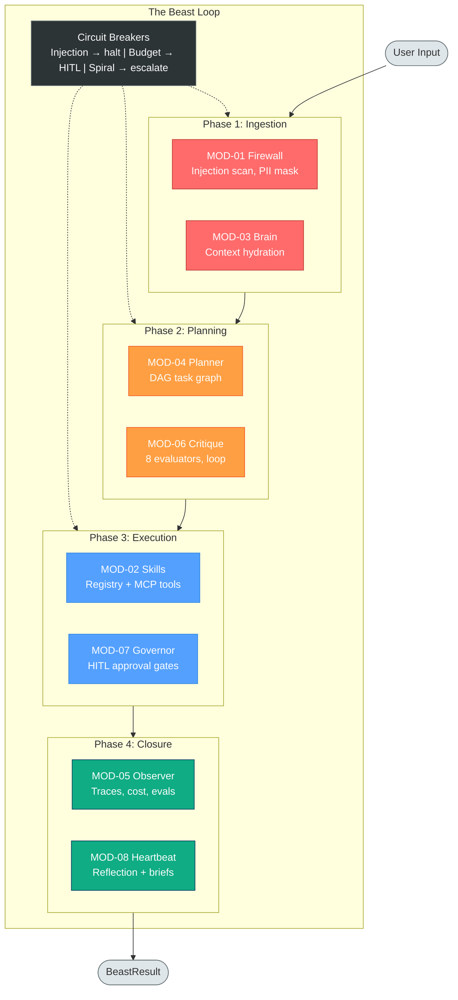
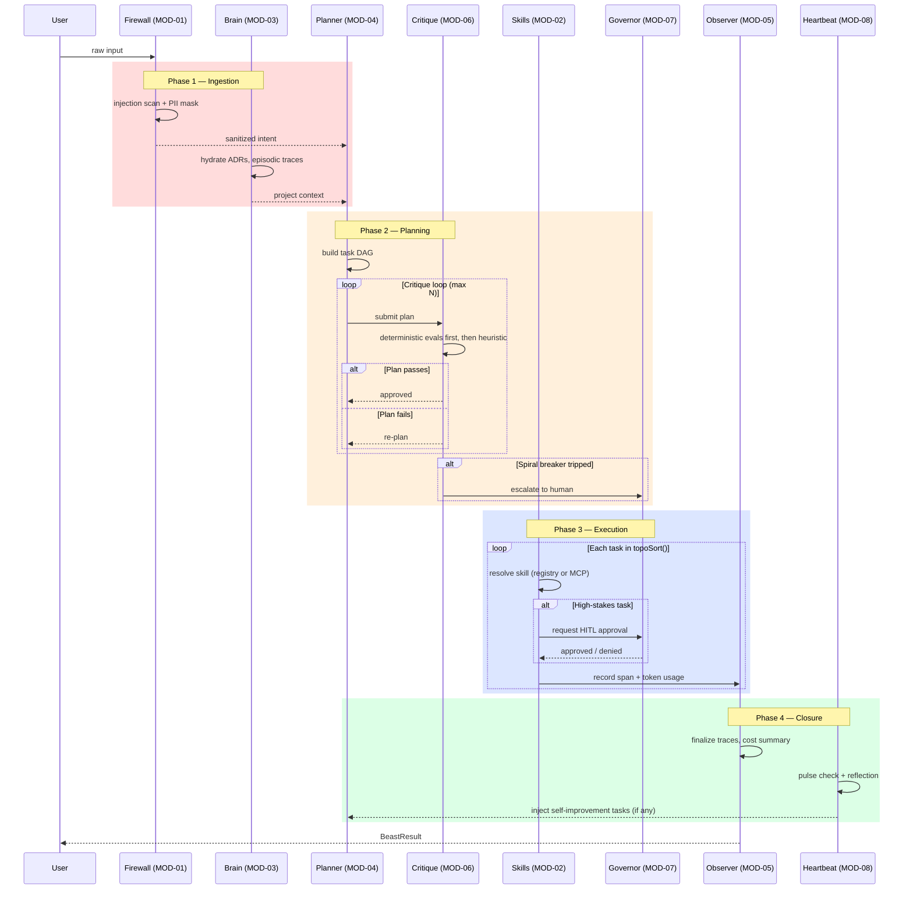
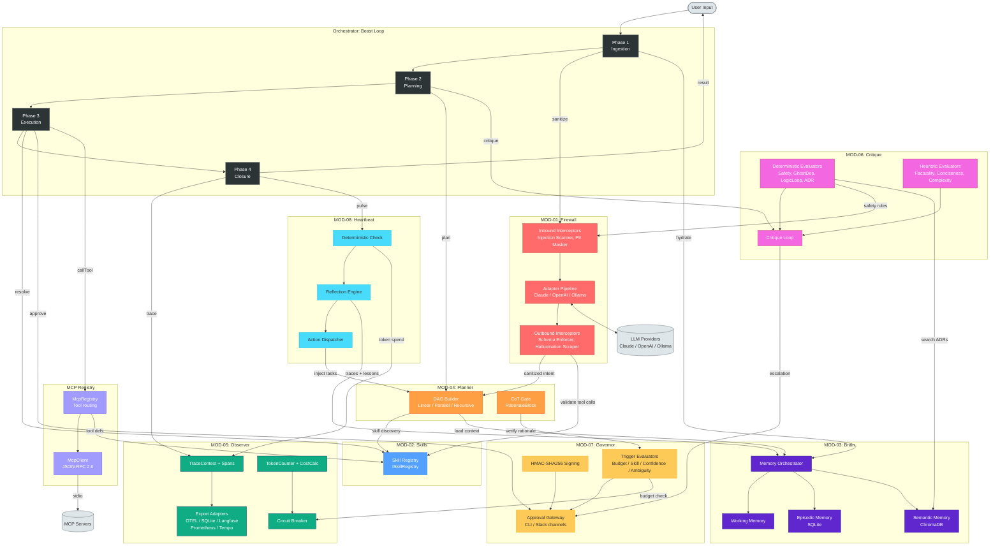

# Frankenbeast

<p align="center">
  
</p>

**Deterministic guardrails for AI agents.**

Frankenbeast is a safety framework that enforces guardrails *outside* the LLM's context window. Every check that can be deterministic is deterministic — regex-based injection scanning, schema validation, dependency whitelisting, DAG cycle detection, HMAC signature verification. These do not hallucinate.

## Why This Exists

LLM-based agents routinely lose safety constraints when context windows compress, hallucinate tool calls that violate architectural rules, and take destructive actions without human oversight. Frankenbeast solves this by placing safety enforcement in a deterministic pipeline that the LLM cannot bypass, forget, or summarise away.

**The key guarantee:** Safety constraints survive context-window compression because they are enforced by the firewall pipeline, not by the LLM prompt.

## Architecture

Frankenbeast is organized as 13 packages: 8 core modules plus `franken-types`, `franken-mcp`, `franken-orchestrator`, `franken-comms`, and `franken-web`. Most module boundaries are expressed as typed ports/adapters, but the current local CLI path also imports concrete observer classes through `CliObserverBridge`.

See [docs/ARCHITECTURE.md](docs/ARCHITECTURE.md) for the full interconnection diagram.



### Beast Loop Sequence



### Module Interconnections



## Modules

| # | Module | Role |
|---|--------|------|
| 01 | [frankenfirewall](https://github.com/djm204/franken-firewall) | Model-agnostic proxy — PII masking, injection scanning, schema enforcement. Claude, OpenAI, and Ollama adapters. |
| 02 | [franken-skills](https://github.com/djm204/franken-skills) | Skill registry — discovery, validation, and loading of tool definitions. |
| 03 | [franken-brain](https://github.com/djm204/franken-brain) | Three-tier memory — working (in-process), episodic (SQLite), semantic (ChromaDB). |
| 04 | [franken-planner](https://github.com/djm204/franken-planner) | Intent → DAG task graphs. Linear, Parallel, and Recursive planning strategies. |
| 05 | [franken-observer](https://github.com/djm204/franken-observer) | Flight data recorder — tracing, cost tracking, evals, export to OTEL/Langfuse/Prometheus/Tempo. |
| 06 | [franken-critique](https://github.com/djm204/franken-critique) | Plan validation — 8 evaluators (deterministic first), circuit breakers, lesson recorder. |
| 07 | [franken-governor](https://github.com/djm204/franken-governor) | Human-in-the-loop — trigger evaluators, approval channels (CLI/Slack), HMAC-signed approvals. |
| 08 | [franken-heartbeat](https://github.com/djm204/franken-heartbeat) | Proactive reflection — scheduled pulse checks, self-improvement task injection. |
| — | [franken-types](https://github.com/djm204/franken-types) | Shared type definitions — TaskId, Severity, Result, RationaleBlock, TokenSpend. |
| — | [franken-orchestrator](https://github.com/djm204/franken-orchestrator) | The Beast Loop — wires all modules into a 4-phase agent pipeline with circuit breakers. |
| — | [franken-mcp](https://github.com/djm204/franken-mcp) | MCP (Model Context Protocol) server — tool discovery, constraint resolution, JSON-RPC transport. |
| — | franken-comms | External communications gateway — Slack, Discord, Telegram, WhatsApp adapters with signature verification. |
| — | franken-web | React web dashboard — chat UI, configuration, metrics visualization (dev tool, not published). |

### Core Principles

- **Determinism over probabilism.** Regex-based injection scanning, schema validation, HMAC verification — these do not hallucinate.
- **LLM-agnostic.** The firewall is a model-agnostic proxy. Adding a new provider means implementing one `IAdapter` interface.
- **Immutable safety constraints.** Guardrails live in the firewall pipeline, not in the LLM prompt. They cannot be compressed or forgotten.
- **Human-in-the-loop as a first-class primitive.** High-stakes actions require cryptographically signed human approval.
- **Full auditability.** Every decision is traced, costed, and exportable.

## HTTP Services

Four modules expose standalone Hono HTTP servers for use as independent microservices:

| Service | Endpoints |
|---------|-----------|
| Firewall | `POST /v1/chat/completions`, `POST /v1/messages`, `GET /health` |
| Critique | `POST /v1/review`, `GET /health` |
| Governor | `POST /v1/approval/request`, `POST /v1/approval/respond`, `POST /v1/webhook/slack`, `GET /health` |
| Chat Server | `GET /v1/chat/ws` (WebSocket), `POST /v1/chat/message`, `GET /health` |

## Prerequisites

- **Node.js** >= 20.0.0
- **npm** >= 10.0.0

### Optional

- **ChromaDB** — required for semantic memory (MOD-03). Not needed for unit/integration tests.
- **LLM API key** — `ANTHROPIC_API_KEY` or `OPENAI_API_KEY` for runtime use. Not needed for tests (mocked).
- **Docker** — for running the local dev stack (ChromaDB, Grafana, Tempo).

## Quick Start

```bash
# Clone the repository
git clone <repo-url> frankenbeast
cd frankenbeast

# Install all dependencies
npm install

# Build all modules
npm run build

# Run root-level integration tests
npm test

# Run all tests (per-module + root)
npm run test:all
```

See [docs/guides/quickstart.md](docs/guides/quickstart.md) for the full setup guide including Docker services.

## Usage

### Interactive Session (idea to PR)

```bash
# Start from scratch — interview, design, plan, execute
frankenbeast

# Start from an existing design document
frankenbeast --design-doc docs/my-feature-design.md

# Start from existing chunk files
frankenbeast --plan-dir ./my-chunks/
```

Rerunning against an existing `.frankenbeast/.build/.checkpoint` file can skip completed tasks. The `--resume` flag is parsed by the CLI, but it is not yet wired as a distinct resume mode.

### Subcommands

```bash
# Interview only — generates .frankenbeast/plans/design.md
frankenbeast interview

# Plan only — decomposes design doc into chunk files
frankenbeast plan --design-doc design.md

# Run only — executes chunks from .frankenbeast/plans/
frankenbeast run

# Interactive chat — two-tier REPL (conversational + execution)
frankenbeast chat

# Chat server — HTTP + WebSocket for franken-web dashboard
frankenbeast chat-server --port 3000

# GitHub issues — fetch, triage, and fix issues autonomously
frankenbeast issues --label bug --repo owner/repo
```

### Options

```
--base-dir <path>       Project root (default: cwd)
--base-branch <name>    Git base branch (default: main)
--budget <usd>          Budget limit in USD (default: 10)
--provider <name>       claude | codex | gemini | aider (default: claude)
--providers <list>      Comma-separated fallback chain (e.g. claude,gemini,aider)
--design-doc <path>     Path to design document
--plan-dir <path>       Path to chunk files directory
--config <path>         Path to config file (JSON)
--no-pr                 Skip PR creation after execution
--verbose               Debug logs + trace viewer on :4040
--reset                 Clear checkpoint and traces
--cleanup               Remove all build artifacts from .frankenbeast/.build/
--help                  Show help
```

**Issues-specific flags:**

```
--label <labels>        Comma-separated labels (e.g. critical,high)
--search <query>        GitHub search syntax
--milestone <name>      Filter by milestone
--assignee <user>       Filter by assignee
--limit <n>             Max issues to fetch (default: 30)
--repo <owner/repo>     Target repository (auto-inferred if omitted)
--dry-run               Preview triage without executing
```

**Chat server flags:**

```
--host <addr>           Server bind address (default: localhost)
--port <n>              Server port (default: 3000)
--allow-origin <url>    CORS origin for dashboard
```

### Project Layout

Running `frankenbeast` in any project creates:

```
your-project/
  .frankenbeast/
    config.json              # optional project config
    plans/
      design.md              # generated by interview
      01_chunk.md, 02_...    # generated from design
    .build/
      <plan-name>.checkpoint              # plan-scoped execution state
      <plan-name>-<datetime>-build.log    # plan-scoped session log (crash-safe, written incrementally)
      build-traces.db                     # observer traces
```

## Running Tests

```bash
# All tests across all packages (2,937 tests)
npm test

# Per-package tests via Turborepo
npx turbo run test --filter=franken-brain

# Orchestrator E2E tests
cd packages/franken-orchestrator && npm run test:e2e
```

## Local Dev Environment

```bash
# Start supporting services (ChromaDB, Grafana, Tempo)
cp .env.example .env
docker compose up -d

# Seed ChromaDB with initial collections
npx tsx scripts/seed.ts

# Verify everything is running
npx tsx scripts/verify-setup.ts
```

## Configuration

### Environment Variables

| Variable | Module | Required | Description |
|----------|--------|----------|-------------|
| `ANTHROPIC_API_KEY` | MOD-01 | Runtime only | Claude adapter API key |
| `OPENAI_API_KEY` | MOD-01 | Runtime only | OpenAI adapter API key |
| `CHROMA_HOST` | MOD-03 | If using semantic memory | ChromaDB server host (default: `localhost`) |
| `CHROMA_PORT` | MOD-03 | If using semantic memory | ChromaDB server port (default: `8000`) |
| `SLACK_WEBHOOK_URL` | MOD-07 | If using Slack approvals | Slack webhook for HITL notifications |

See [.env.example](.env.example) for the full list.

### Module Configuration

All modules use **dependency injection** — configuration is passed via constructor arguments, not globals or environment variables.

```typescript
// Orchestrator — via config file or CLI flags
frankenbeast plan --design-doc docs/my-feature-design.md --config frankenbeast.config.json

// Firewall — standalone service
import { createFirewallApp } from 'frankenfirewall/server';
const app = createFirewallApp({ port: 9090 });

// Critique — standalone service
import { createCritiqueApp } from 'franken-critique/server';
const app = createCritiqueApp({ pipeline, bearerToken: 'secret' });
```

## The Beast Loop

The orchestrator manages execution through four phases with circuit breakers at each stage.

### Phase 1: Ingestion & Hydration

**Modules:** MOD-01 (Firewall) + MOD-03 (Memory)

Raw user input is scrubbed for PII and scanned for injection attacks by the firewall. Relevant ADRs and episodic traces are loaded from memory to give the agent contextual wisdom.

### Phase 2: Recursive Planning

**Modules:** MOD-04 (Planner) + MOD-06 (Critique)

The Planner generates a Task DAG. The Critique module audits it with 8 evaluators (deterministic evaluators run first, then heuristic). If critique fails, the orchestrator forces a re-plan (max 3 iterations). After 3 failures, it escalates to a human via MOD-07.

### Phase 3: Validated Execution

**Modules:** MOD-02 (Skills) + MOD-07 (Governor)

Tasks execute in topological order from the DAG. High-stakes tasks pause for human approval via the Governor's trigger evaluators (budget, skill, confidence, ambiguity). Every task result is recorded to memory and traced.

### Phase 4: Observability & Closure

**Modules:** MOD-05 (Observer) + MOD-08 (Heartbeat)

The trace is closed and token spend summarised. In the current local CLI path, heartbeat is still stubbed in `franken-orchestrator/src/cli/dep-factory.ts`, so heartbeat-driven self-improvement should be treated as target architecture rather than a verified end-to-end local flow.

### Circuit Breakers

| Trigger | Action |
|---------|--------|
| Injection detected (MOD-01) | Immediate halt |
| Budget exceeded (MOD-05) | Escalate to HITL |
| Critique fails 3x (MOD-06) | Escalate to human |

### Resilience

- **Context serialization** — BeastContext snapshots saved to disk for crash recovery
- **Graceful shutdown** — SIGTERM/SIGINT handlers save state before exit
- **Module health checks** — all 8 modules probed on startup

## Adding a New LLM Provider

Frankenbeast is LLM-agnostic. The firewall includes Claude, OpenAI, and Ollama adapters. To add a new provider:

1. **Implement `IAdapter`** — see [docs/guides/add-llm-provider.md](docs/guides/add-llm-provider.md)
2. **Run conformance tests** — `runAdapterConformance(factory, fixtures)` validates all 4 `IAdapter` methods
3. **Register** the adapter in `AdapterRegistry`

## Wrapping External Agents

The firewall can wrap *any* agent framework as a standalone governance layer:

```
Your Agent → Frankenbeast Firewall Proxy → LLM Provider
```

Safety constraints live in the proxy pipeline, not in the agent's prompt — so they survive context-window compression. See [docs/guides/wrap-external-agent.md](docs/guides/wrap-external-agent.md) and the [OpenClaw integration example](examples/openclaw-integration/).

## Examples

The [examples/](examples/) directory contains working integrations organized by complexity:

**Quickstart** — minimal hello-world for each provider:
- [claude-hello](examples/quickstart/claude-hello/) — Anthropic Claude via `@anthropic-ai/sdk`
- [openai-hello](examples/quickstart/openai-hello/) — OpenAI via `openai` SDK
- [ollama-hello](examples/quickstart/ollama-hello/) — Local Ollama models

**Patterns** — production-ready integration patterns:
- [cost-aware-routing](examples/patterns/cost-aware-routing/) — complexity-based provider selection
- [multi-provider-fallback](examples/patterns/multi-provider-fallback/) — automatic failover between providers
- [tool-calling](examples/patterns/tool-calling/) — structured tool use with validation
- [local-model-gallery](examples/patterns/local-model-gallery/) — running local models through the firewall

**Scenarios** — complete agent setups:
- [code-review-agent](examples/scenarios/code-review-agent/) — automated code review with HITL gates
- [research-agent-hitl](examples/scenarios/research-agent-hitl/) — research agent with human approval checkpoints
- [privacy-first-local](examples/scenarios/privacy-first-local/) — fully local pipeline with PII masking

## Martin Loop Build System

Frankenbeast includes an observer-powered autonomous build runner (MartinLoop) integrated into the orchestrator — iterative AI loops that process chunk files with deterministic completion detection.

Features:
- **Observer tracing** — TraceContext spans per iteration, TokenCounter + CostCalculator per chunk
- **Budget enforcement** — CircuitBreaker stops execution when spend exceeds limit
- **Loop detection** — LoopDetector identifies stuck sessions
- **Checkpoint/resume** — crash recovery via FileCheckpointStore
- **Chunk sessions** — canonical execution state with pre-compaction snapshots and context-window-aware compaction at >= 85% usage
- **Rate limit handling** — automatic provider fallback chain (e.g. Claude → Gemini → Aider)
- **Git isolation** — per-chunk branches via GitBranchIsolator, auto-commit, merge back to base
- **4 pluggable providers** — Claude, Codex, Gemini, Aider via ProviderRegistry

See [docs/beast-loop-explained.md](docs/beast-loop-explained.md) for the full iteration mechanics.

## Chat System

The `frankenbeast chat` REPL provides a two-tier interactive experience:

- **Tier 1 (Conversational)** — cheap model with session continuation, quirky spinner, colored output (cyan prompt, green replies)
- **Tier 2 (Execution)** — `/run <desc>` spawns a full-permissions CLI agent. `/plan <desc>` dispatches to planning. Natural language triggers execution via IntentRouter → EscalationPolicy
- **Output sanitization** — strips raw web search JSON blobs and REMINDER instruction blocks from Claude CLI output
- **Session persistence** — file-backed session store for conversation history across restarts

The `frankenbeast chat-server` exposes the same runtime over HTTP + WebSocket for the `franken-web` dashboard.

## Communications Gateway (franken-comms)

Multi-channel external communications with deterministic session mapping:

| Channel | Transport | Security |
|---------|-----------|----------|
| Slack | Events API + Interactivity | HMAC-SHA256 signature verification |
| Discord | Gateway events | ED25519 signature verification |
| Telegram | Webhook | Token-based authentication |
| WhatsApp | Cloud API | SHA256 signature verification |

All channels route through a unified `ChatGateway` → `SocketBridge` → `SessionMapper` pipeline. See [ADR-016](docs/adr/016-external-comms-gateway.md).

## Project Status

| Phase | Description | Status |
|-------|-------------|--------|
| 1 | Individual Module Implementation | Complete |
| 2 | LLM-Agnostic Adapter Layer | Complete (PRs 15-18) |
| 3 | Inter-Module Contracts & Shared Types | Complete (PRs 19-24) |
| 4 | The Orchestrator ("Beast Loop") | Complete (PRs 25-30) |
| 5 | Guardrails as a Service (HTTP) | Complete (PRs 31-35) |
| 6 | End-to-End Testing & Hardening | Complete (PRs 36-39) |
| 7 | CLI & Developer Experience | Complete (PRs 40-42) |
| 8 | CLI Skill Execution (Martin Loop) | Complete |
| 9 | Interactive Chat & Two-Tier Dispatch | Complete |
| 10 | Chat Server (HTTP + WebSocket) | Complete |
| 11 | External Comms (Slack/Discord/Telegram/WhatsApp) | Complete |
| 12 | GitHub Issues Pipeline | Complete |

**2,937 tests across 13 packages, all passing.**

See [docs/PROGRESS.md](docs/PROGRESS.md) for the full PR-by-PR breakdown.

### In Progress

- **Web Dashboard** — React-based UI (`franken-web`) for chat, configuration, and metrics visualization. Scaffold in place, integration ongoing.
- **Escalation Policy Hardening** — Refining intent routing and tier escalation logic for the chat REPL.

## Development

### Working on a package

All packages live under `packages/` in the monorepo:

```bash
# Build and test a single package
npx turbo run test --filter=franken-brain
npx turbo run build --filter=franken-brain

# Or work directly in the package
cd packages/franken-brain && npm test
```

### Testing patterns

All modules follow the same patterns:

- **Vitest** as test runner
- **Dependency injection** — all external deps are constructor-injected
- **Mock factories** — `vi.fn()` stubs for port interfaces
- **No I/O in unit tests** — real SQLite only in integration tests (`:memory:` mode)
- **Zod validation** at all system boundaries

### Project structure

```
frankenbeast/
├── README.md
├── package.json                 # Root workspace + Turborepo scripts
├── turbo.json                   # Build orchestration (build, test, typecheck)
├── docker-compose.yml           # Local dev stack (ChromaDB, Grafana, Tempo)
├── frankenbeast.config.example.json
├── assets/img/                  # Project logos
├── docs/
│   ├── ARCHITECTURE.md          # System overview with Mermaid diagrams
│   ├── PROGRESS.md              # PR-by-PR implementation tracker
│   ├── RAMP_UP.md               # Concise agent onboarding doc
│   ├── CONTRACT_MATRIX.md       # Port interface compatibility matrix
│   ├── beast-loop-explained.md  # Iteration mechanics deep dive
│   ├── adr/                     # 16 Architecture Decision Records
│   ├── guides/                  # Quickstart, add-provider, wrap-agent, run-dashboard-chat
│   └── plans/                   # Design docs and implementation plans
├── tests/                       # Root-level integration tests
├── scripts/                     # seed.ts, verify-setup.ts
├── examples/
│   ├── quickstart/              # claude-hello, openai-hello, ollama-hello
│   ├── patterns/                # cost-aware-routing, tool-calling, fallback
│   ├── scenarios/               # code-review-agent, research-agent-hitl
│   └── openclaw-integration/    # External agent wrapping example
├── packages/
│   ├── frankenfirewall/         # MOD-01: Firewall/Guardrails
│   ├── franken-skills/          # MOD-02: Skill Registry
│   ├── franken-brain/           # MOD-03: Memory Systems
│   ├── franken-planner/         # MOD-04: Planning & Decomposition
│   ├── franken-observer/        # MOD-05: Observability
│   ├── franken-critique/        # MOD-06: Self-Critique & Reflection
│   ├── franken-governor/        # MOD-07: HITL & Governance
│   ├── franken-heartbeat/       # MOD-08: Proactive Reflection
│   ├── franken-types/           # Shared type definitions
│   ├── franken-orchestrator/    # The Beast Loop & CLI (bin: frankenbeast)
│   ├── franken-mcp/             # MCP server (Model Context Protocol)
│   ├── franken-comms/           # External comms (Slack/Discord/Telegram/WhatsApp)
│   └── franken-web/             # React web dashboard (dev tool)
└── .frankenbeast/               # Project-scoped runtime state (gitignored)
```

## Documentation

- [Architecture](docs/ARCHITECTURE.md) — system overview with Mermaid diagrams
- [Beast Loop Explained](docs/beast-loop-explained.md) — the 5 interlocking loops and their mechanics
- [Quickstart Guide](docs/guides/quickstart.md) — get running in 7 steps
- [Run the Dashboard Chat](docs/guides/run-dashboard-chat.md) — start the WebSocket chat server and dashboard locally
- [Run the Network Operator](docs/guides/run-network-operator.md) — start Frankenbeast request-serving services through `frankenbeast network`
- [Add an LLM Provider](docs/guides/add-llm-provider.md) — implement `IAdapter` in 4 steps
- [Wrap an External Agent](docs/guides/wrap-external-agent.md) — firewall-as-proxy or full orchestration
- [Contract Matrix](docs/CONTRACT_MATRIX.md) — all port interfaces documented
- [ADRs](docs/adr/) — architectural decisions and rationale
- [Design Plans](docs/plans/) — design docs and implementation plans

## License

ISC
