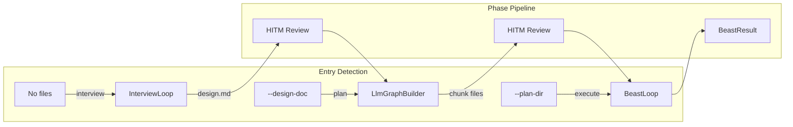

# Chunk 11: Documentation & ADR

## Objective

Update ARCHITECTURE.md, write an ADR for the global CLI design decision, and update the README usage section to document the new CLI surface.

## Files

- **Modify**: `docs/ARCHITECTURE.md` — add CLI pipeline section
- **Create**: `docs/adr/007-global-cli-design.md` — ADR for global CLI decision
- **Modify**: `README.md` — update usage section with new CLI commands

## Key Reference Files

- `docs/plans/2026-03-06-cli-e2e-design.md` — full design spec
- `docs/ARCHITECTURE.md` — existing architecture doc
- `docs/adr/` — existing ADRs (check latest number)
- `README.md` — existing README

## ADR Content

`docs/adr/007-global-cli-design.md`:
```markdown
# ADR 007: Global CLI Design

## Status

Accepted

## Context

Frankenbeast's CLI (`franken-orchestrator/src/cli/run.ts`) was stub-level — only `--dry-run` worked. The real execution capability lived in per-plan `build-runner.ts` files (e.g., `plan-approach-c/build-runner.ts`). Users had to copy and adapt the build-runner for each new plan.

We need a single `frankenbeast` command that works as a drop-in tool in any project.

## Decision

1. **Global installation.** `frankenbeast` is installed globally via `npm install -g franken-orchestrator`. It works in any project without being a project dependency.

2. **Convention-based project layout.** Project state lives in `.frankenbeast/` at the project root:
   - `.frankenbeast/plans/` — design docs and chunk files
   - `.frankenbeast/.build/` — checkpoint, traces, logs
   - `.frankenbeast/config.json` — optional project-level config

3. **Three entry modes with HITM review loops:**
   - No files → interview → design doc → [review] → chunks → [review] → execution
   - `--design-doc` → chunks → [review] → execution
   - `--plan-dir` or chunks in `.frankenbeast/plans/` → execution

4. **Subcommands as building blocks.** `frankenbeast interview`, `frankenbeast plan`, `frankenbeast run` for standalone phase execution.

5. **Base branch safety.** Auto-detects current branch, prompts for confirmation if not `main`.

## Consequences

- Per-plan `build-runner.ts` files are no longer needed for new plans
- Users can go from idea to PR in a single interactive session
- Project-local module access (importing individual modules) is deferred to a future iteration
- Additional CLI provider support (beyond claude/codex) is deferred

## Supersedes

None (new capability).
```

## README Usage Section

Add after the "Quick Start" section:

```markdown
## Usage

### Interactive Session (idea to PR)

```bash
# Start from scratch — interview, design, plan, execute
frankenbeast

# Start from an existing design document
frankenbeast --design-doc docs/my-feature-design.md

# Start from existing chunk files
frankenbeast --plan-dir ./my-chunks/

# Resume a previous execution
frankenbeast run --resume
```

### Subcommands

```bash
# Interview only — generates .frankenbeast/plans/design.md
frankenbeast interview

# Plan only — decomposes design doc into chunk files
frankenbeast plan --design-doc design.md

# Run only — executes chunks from .frankenbeast/plans/
frankenbeast run
```

### Options

```
--base-dir <path>       Project root (default: cwd)
--base-branch <name>    Git base branch (default: main)
--budget <usd>          Budget limit in USD (default: 10)
--provider <name>       claude | codex (default: claude)
--no-pr                 Skip PR creation after execution
--verbose               Debug logs + trace viewer on :4040
--reset                 Clear checkpoint and traces
--config <path>         Path to config file (JSON)
--help                  Show help
```

### Project Layout

Running `frankenbeast` in any project creates:

```
your-project/
  .frankenbeast/
    config.json              # optional project config
    plans/
      design.md              # generated by interview
      01_chunk.md, 02_...    # generated from design
    .build/
      .checkpoint            # execution state
      build-traces.db        # observer traces
      build.log              # session log
```
```

## Architecture Doc Update

Add a new section to `docs/ARCHITECTURE.md` describing the CLI pipeline:

```markdown
## CLI Pipeline

The `frankenbeast` CLI is a globally-installed tool that orchestrates the full development workflow:



All project state lives in `.frankenbeast/` at the project root.
```

## Success Criteria

- [ ] ADR 007 written with context, decision, and consequences
- [ ] README usage section documents all three entry modes
- [ ] README documents subcommands and global flags
- [ ] README documents project layout
- [ ] ARCHITECTURE.md updated with CLI pipeline diagram
- [ ] ADR number doesn't conflict with existing ADRs
- [ ] All links in README are valid

## Verification Command

```bash
# Check ADR exists and has required sections
grep -q "## Status" docs/adr/007-global-cli-design.md && \
grep -q "## Decision" docs/adr/007-global-cli-design.md && \
grep -q "## Usage" README.md && \
echo "Docs verified"
```

## Hardening Requirements

- Check the actual latest ADR number before creating — use 007 only if 006 is the latest
- README changes should be additive — do NOT remove existing sections
- ARCHITECTURE.md Mermaid diagram must render correctly
- Do NOT add implementation details to the README — keep it user-facing
